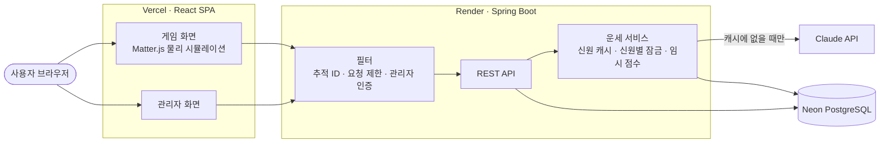

# AI Lucky Pinball

[](https://github.com/tmdgus0324/lucky-pinball-ai/actions/workflows/ci.yml)

사다리타기 대신 만든 웹 추첨 게임입니다. 이름과 생년월일을 입력하면 Claude가 그날의 운세를 분석하고, 운세가 좋을수록 핀볼 트랙의 더 높은 곳(결승선에서 먼, 불리한 위치)에서, 나쁠수록 결승선 가까이에서 출발합니다. 물리 엔진 위에서 가장 늦게 도착한 사람이 당첨자입니다.

- 데모: https://lucky-pinball-ai.vercel.app
- 관리자 화면(`/admin`) 데모 계정: `admin` / `1234` — 시연용으로 공개한 조회 전용 계정입니다(계정은 환경변수로 주입).
- Render 무료 티어라 오래 쉬면 첫 요청에 1~2분이 걸립니다. DB는 Neon이라 데이터는 유지됩니다.

## 기능

- **AI 운세 → 상대평가 버프**: Claude(Haiku 4.5)가 점수·행운의 숫자·메시지를 만들고, 이번 판 최고점자 대비 점수 차이로 시작 높이를 정합니다.
- **같은 사람이면 AI를 다시 부르지 않음**: 이름+생년월일이 같으면 최초 1회만 호출하고 DB 결과를 재사용합니다.
- **핀볼 게임**: Matter.js 갈톤보드 + 회전 막대 장애물, 선두 공을 따라가는 카메라.
- **관리자 화면**: 참가자 이력, 게임 결과, 오류 로그 조회와 Claude 연결 확인.
- **공부하기 > React (extra)**: 예전에 공부한 React 예제를 웹에서 실행하고 챕터별 정리를 펼쳐 보는 학습 페이지.

## 기술 스택

- 백엔드: Java 17, Spring Boot 4, Spring Data JPA, Gradle, Anthropic Java SDK
- 프론트엔드: React 19 + TypeScript + Vite, Matter.js
- DB: Neon PostgreSQL(운영) / H2(로컬·테스트)
- 배포: Render(Docker) + Vercel + Neon
- 테스트·CI: JUnit 109개(단위 · HTTP 통합 · 동시성 · 가짜 Claude 서버), GitHub Actions

## 아키텍처



물리 시뮬레이션은 브라우저에서 돌고, 서버는 참가자·운세·게임 상태를 관리합니다. 요청 흐름, API, DB 스키마, 설계 판단은 [`devdocs/`](./devdocs/README.md)에 정리했습니다.

## 핵심 구현 포인트

- **AI 비용 관리** — 이름+생년월일을 키로 DB를 캐시처럼 쓰고, 같은 사람의 요청이 동시에 몰릴 때 각자 AI를 부르던 경쟁 상태를 **재현 테스트로 먼저 확인**(동시 6건 → 6번 호출)한 뒤 신원별 잠금으로 1번만 호출되게 했습니다. 서로 다른 사람은 기다리지 않습니다. → [`devhelp/09`](./devhelp/09_운영_안정성_로깅_장애_동시성.md)
- **외부 API 장애 대응** — Claude 호출을 타임아웃 10초·재시도 1회로 제한(SDK 기본값 10분·2회)하고, 실패하면 규칙 기반 임시 점수로 게임을 이어갑니다. 임시 점수는 캐시에 넣지 않아 AI가 복구되면 진짜 결과를 받습니다. 관리자 화면에서 키 없음·크레딧 부족·타임아웃을 구분해 점검할 수 있습니다. → [`devhelp/09`](./devhelp/09_운영_안정성_로깅_장애_동시성.md)
- **요청 추적** — 모든 요청에 추적 ID를 붙여 화면의 "오류 ID"로 서버 로그를 바로 찾고, 오류 로그는 DB에 남겨 재배포 후에도 볼 수 있습니다. → [`devhelp/09`](./devhelp/09_운영_안정성_로깅_장애_동시성.md)
- **상대평가 버프** — AI 점수가 60~70점대로 몰려 절대 점수로는 차이가 안 보여서, 이번 판 참가자끼리의 상대평가로 바꿨습니다. → [`devhelp/03`](./devhelp/03_AI_운세와_상대평가_버프.md)
- **교체 가능한 구조** — `FortuneService`(Mock → Claude), `GameRepository`(메모리 → JPA)를 인터페이스로 분리해, 실제로 호출부 변경 없이 교체했습니다. 물리 엔진은 React 밖에 두고 컴포넌트는 마운트·정리만 맡습니다.
- **실측 기반 물리 튜닝** — 공이 벽에 끼거나 벽 통로로 바로 떨어지는 문제를 헤드리스 시뮬레이션과 반복 측정으로 찾아 고쳤습니다. → [`devhelp/02`](./devhelp/02_핀볼_물리와_맵.md)

## 실행 방법

```bash
# 백엔드 — http://localhost:8080 (로컬 DB는 H2 파일, 별도 설치 불필요)
cd backend
./gradlew bootRun     # 실제 운세에는 ANTHROPIC_API_KEY 환경변수 필요(없으면 생년월일 없는 참가자만)
./gradlew test

# 프론트엔드 — http://localhost:5173
cd frontend-react
npm install
npm run dev
```

관리자 로그인을 쓰려면 `ADMIN_PASSWORD` 환경변수를 지정합니다(비어 있으면 로그인이 항상 거절됩니다). 개발 환경 준비 과정은 [`devhelp/01`](./devhelp/01_MVP_구현_기록.md)에 있습니다.

## 폴더

```
backend/         Spring Boot (Dockerfile 포함)
frontend-react/  React 프론트엔드 (주력)
frontend/        Vanilla JS 프론트엔드 (기존 버전, 병행 유지)
devdocs/         현재 기준 설명서 — 아키텍처, API, DB, 한계, 테스트
devhelp/         구현 기록과 트러블슈팅 — 주제별 12개 문서
plan/            처음 설계할 때의 계획 문서
```

## 알려진 한계

규모(서버 1대, 한 판 최대 8명)에 맞춰 단순하게 둔 부분이 있습니다. 대표적인 것은 다음과 같고, 전체 목록과 개선 방향은 [`devdocs/04`](./devdocs/04_알려진_한계와_개선_방향.md)에 있습니다.

- 물리 시뮬레이션이 브라우저에서 돌아서, 서버는 보고된 도착 순서가 조작됐는지 검증할 수 없습니다.
- 신원별 잠금·요청 제한·관리자 토큰이 서버 메모리에 있어 서버 1대를 전제로 합니다.
- 프론트엔드는 자동 테스트가 없고, 브라우저 확인 스크립트로 수동 검증했습니다.

## 출처와 참고

- 게임 방식(결승선 통과 순서 경쟁)과 회전 막대 장애물 아이디어는 lazygyu의 [Marble Roulette](https://lazygyu.github.io/roulette/)([lazygyu/roulette](https://github.com/lazygyu/roulette), MIT 라이선스)에서 영감을 받았습니다.
- 물리와 맵은 Matter.js로 직접 구현했습니다. 맵 구조(갈톤보드), 장애물 크기·배치·회전 속도 등 모든 수치와 코드는 이 프로젝트에서 새로 작성했고, 원본의 코드·맵 데이터·이미지는 사용하지 않았습니다.
- AI 운세 분석, 상대평가 버프, 캐시 구조는 이 프로젝트의 독자 기능입니다.
- "Marble Roulette"와 "마블 룰렛"은 lazygyu의 상표이며, 이 프로젝트는 원작자와 제휴·후원 관계가 없는 개인 포트폴리오 프로젝트입니다.
- 물리 엔진 [Matter.js](https://brm.io/matter-js/)는 MIT 라이선스입니다.
