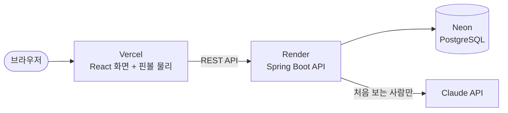

# AI Lucky Pinball

[](https://github.com/tmdgus0324/lucky-pinball-ai/actions/workflows/ci.yml)

사다리타기 대신 쓰는 웹 추첨 게임입니다. 이름과 생년월일을 넣으면 Claude가 오늘의 운세를 봐 주고, 운세가 좋은 사람일수록 결승선에서 먼 곳에서 출발합니다. 핀볼 판을 가장 늦게 내려온 사람이 당첨입니다.

- 데모: https://lucky-pinball-ai.vercel.app
- 관리자 화면(`/admin`) 데모 계정: `admin` / `1234`
- 무료 서버라 오래 쉬었다가 처음 접속하면 1~2분 걸릴 수 있습니다.

## 기능

- AI 운세: Claude(Haiku 4.5)가 점수, 행운의 숫자, 메시지를 만듭니다. 출발 높이는 이번 판 참가자끼리 점수를 비교해서 정합니다.
- 비용 절약: 같은 이름과 생년월일이면 처음 한 번만 AI를 부르고, 그 뒤로는 DB에 저장된 결과를 씁니다.
- 핀볼 게임: Matter.js로 만든 핀볼 판, 회전 막대 장애물, 선두 공을 따라가는 카메라
- 관리자 화면: 참가자 이력, 게임 결과, 오류 로그 조회, Claude 연결 확인
- 공부하기 > React: 예전에 공부한 React 예제를 웹에서 실행해 보는 학습 페이지(덤)

## 기술 스택

- 백엔드: Java 17, Spring Boot 4, Spring Data JPA, Gradle, Anthropic Java SDK
- 프론트엔드: React 19, TypeScript, Vite, Matter.js
- DB: PostgreSQL(Neon, 운영), H2(로컬·테스트)
- 배포: Render(Docker), Vercel, Neon
- 테스트·CI: JUnit 109개, GitHub Actions

## 구조



핀볼 물리는 브라우저에서 돌고, 서버는 참가자와 운세, 게임 결과를 저장합니다. 자세한 구조와 API는 [devdocs](./devdocs/README.md)에 있습니다.

## 핵심 구현 포인트

- AI 비용 관리: 같은 사람은 DB 결과를 재사용하고, 동시에 요청이 와도 AI는 한 번만 부릅니다. ([devhelp/09](./devhelp/09_운영_안정성_로깅_장애_동시성.md))
- 장애 대응: Claude가 실패하면 임시 점수로 게임을 계속하고, 오류는 추적 ID로 찾을 수 있습니다. ([devhelp/09](./devhelp/09_운영_안정성_로깅_장애_동시성.md))
- 보안: 운영 중에 찾은 요청 제한 우회 문제를 직접 재현하고 고쳤습니다. ([devhelp/08](./devhelp/08_보안과_관리자_기능.md))
- 상대평가: AI 점수가 60~70점대에 몰리는 문제를 참가자끼리 비교하는 방식으로 풀었습니다. ([devhelp/03](./devhelp/03_AI_운세와_상대평가_버프.md))
- 교체 가능한 구조: AI(Mock → Claude)와 저장소(메모리 → DB)를 호출하는 코드 수정 없이 바꿨습니다.
- 물리 버그 수정: 공이 벽에 끼는 문제를 시뮬레이션으로 재현해서 고쳤습니다. ([devhelp/02](./devhelp/02_핀볼_물리와_맵.md))

## 폴더

```
backend/         Spring Boot 백엔드
frontend-react/  React 프론트엔드
frontend/        처음 만든 Vanilla JS 버전(남겨 둠)
devdocs/         구조, API와 DB, 테스트 설명
devhelp/         로컬 실행 방법, 작업 기록, 알려진 한계
plan/            처음 설계할 때의 계획
```

## 출처

게임 방식은 lazygyu의 [Marble Roulette](https://lazygyu.github.io/roulette/)(MIT)에서 아이디어를 얻었고, 코드와 맵은 [Matter.js](https://brm.io/matter-js/)로 직접 만들었습니다. 원작자와는 관계가 없습니다.
