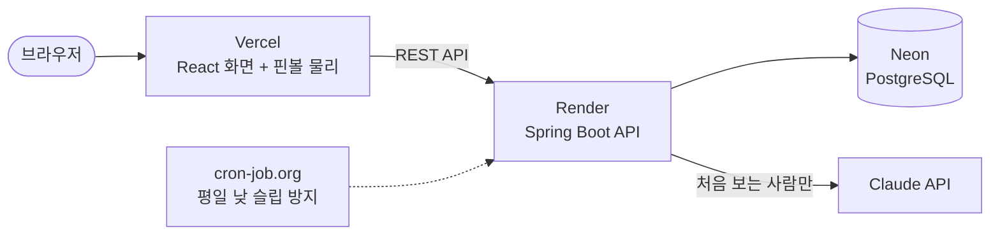

# 01. 구조

AI Lucky Pinball이 어떤 부분으로 이루어져 있고, 요청이 어떻게 흘러가는지 정리한 문서입니다.

## 1. 전체 그림



| 구성 | 기술 | 하는 일 |
|---|---|---|
| 프론트엔드 | React 19, TypeScript, Vite, Matter.js | 화면, 핀볼 물리 시뮬레이션(브라우저에서 실행) |
| 백엔드 | Java 17, Spring Boot 4, Spring Data JPA | 참가자·운세·게임 저장, Claude 호출, 관리자 API |
| DB | Neon PostgreSQL(운영), H2(로컬·테스트) | 참가자, 운세 이력, 게임 결과, 오류 로그 |
| AI | Claude Haiku 4.5 | 운세 점수, 행운의 숫자, 메시지 생성 |
| 배포 | Vercel, Render(Docker), Neon | `master`에 push하면 자동 배포 |

## 2. 게임 한 판의 흐름

1. **참가자 등록** (`POST /api/player`): 이름과 생년월일(선택)을 저장합니다.
2. **운세 확인** (`POST /api/fortune`): 같은 이름+생년월일의 결과가 DB에 있으면 재사용하고, 없을 때만 Claude를 부릅니다. 생년월일이 없으면 운세 없이 참여합니다.
3. **게임 생성** (`POST /api/game/create`): 이번 판 최고점자와의 점수 차이로 각자의 출발 높이를 정합니다. 운세가 좋을수록 결승선에서 먼 곳에서 출발합니다.
4. **게임 진행**: 물리 시뮬레이션은 브라우저에서 돌고, 가장 늦게 도착한 사람이 당첨입니다.
5. **결과 보고** (`POST /api/game/result`): 브라우저가 도착 순서를 보내면 서버가 참가자 구성을 확인하고 저장합니다.

## 3. 서버에서 요청이 지나가는 순서

```
요청 → 추적 ID 필터 → 요청 제한 필터 → 관리자 인증 필터 → 컨트롤러 → 서비스 → DB
```

- **추적 ID 필터**: 요청마다 8자리 ID를 붙입니다. 응답 헤더 `X-Trace-Id`와 서버 로그에 같은 ID가 남아서, 화면에 보인 "오류 ID"로 로그를 찾을 수 있습니다.
- **요청 제한 필터**: 같은 IP에서 1분에 운세 20회, 관리자 로그인 10회를 넘으면 429로 막습니다.
- **관리자 인증 필터**: `/api/admin/**`는 로그인 토큰이 있어야 통과합니다(로그인 요청만 예외).
- 오류가 나면 `GlobalExceptionHandler`가 `{ "error", "traceId" }` 형식으로 응답하고, 오류 로그를 DB에 저장합니다.

## 4. 폴더와 패키지

**백엔드** (`backend/src/main/java/com/luckypinball/`)

| 패키지 | 하는 일 |
|---|---|
| `player` | 참가자 등록, DB TEST용 기존 참가자 조회 |
| `fortune` | 운세 조회(캐시·잠금·임시 점수), Claude 호출, 출발 높이 계산, AI 연결 확인 |
| `game` | 게임 생성·시작·결과 저장 |
| `admin` | 관리자 로그인, 참가자·게임·오류 로그 조회 |
| `common` | 필터(추적 ID, 요청 제한), 예외 처리, 오류 로그 저장, 키별 잠금 |
| `config` | CORS 설정 |

**프론트엔드** (`frontend-react/src/`)

| 위치 | 하는 일 |
|---|---|
| `pages/` | 게임(`/`), 관리자(`/admin`), 공부하기(`/study/react`, `/study/spring`) 화면 |
| `components/` | 등록 폼, 운세 카드, 핀볼 보드, 관리자 표 등 |
| `game/engine.ts` | 물리 엔진. React 밖에서 화면을 직접 갱신합니다 |
| `api/client.ts` | API 호출 공통 처리(관리자 토큰, 오류 메시지) |

레거시 Vanilla JS 버전(`frontend/`)도 남아 있습니다. 물리 값을 바꿀 때는 `engine.ts`와 `frontend/js/game.js`를 같이 고칩니다.

## 5. 이렇게 만든 이유

| 선택 | 이유 |
|---|---|
| 물리 시뮬레이션은 브라우저에서 | 서버 부하 없이 부드러운 애니메이션. 대신 서버가 결과 조작을 막지는 못합니다 |
| 바뀔 부분은 인터페이스로 분리 | AI(Mock → Claude), 게임 저장소(메모리 → DB)를 호출하는 코드 수정 없이 교체했습니다 |
| DB를 AI 결과 캐시로 사용 | Redis 없이 같은 사람의 결과를 재사용해 비용을 줄였습니다 |
| 출발 높이는 상대평가 | AI 점수가 60~70점대에 몰려서, 절대 점수로는 차이가 거의 안 보였습니다 |
| Claude 실패 시 임시 점수 | 게임이 멈추지 않게 합니다. 임시 점수는 캐시에 넣지 않아서 AI가 복구되면 진짜 결과를 받습니다 |
| 비밀 값은 환경변수로 | API 키, 운영 DB 주소, 관리자 비밀번호는 코드에 없고 배포 환경에서만 넣습니다 |

이 선택들 때문에 생긴 한계는 [devhelp/13_알려진_한계](../devhelp/13_알려진_한계.md)에 있습니다.
