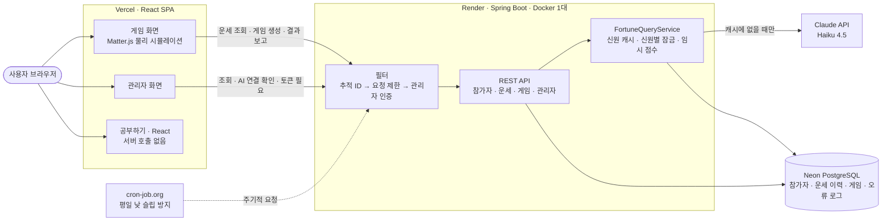
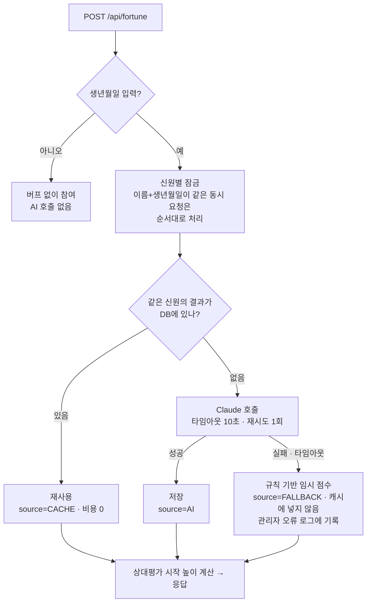
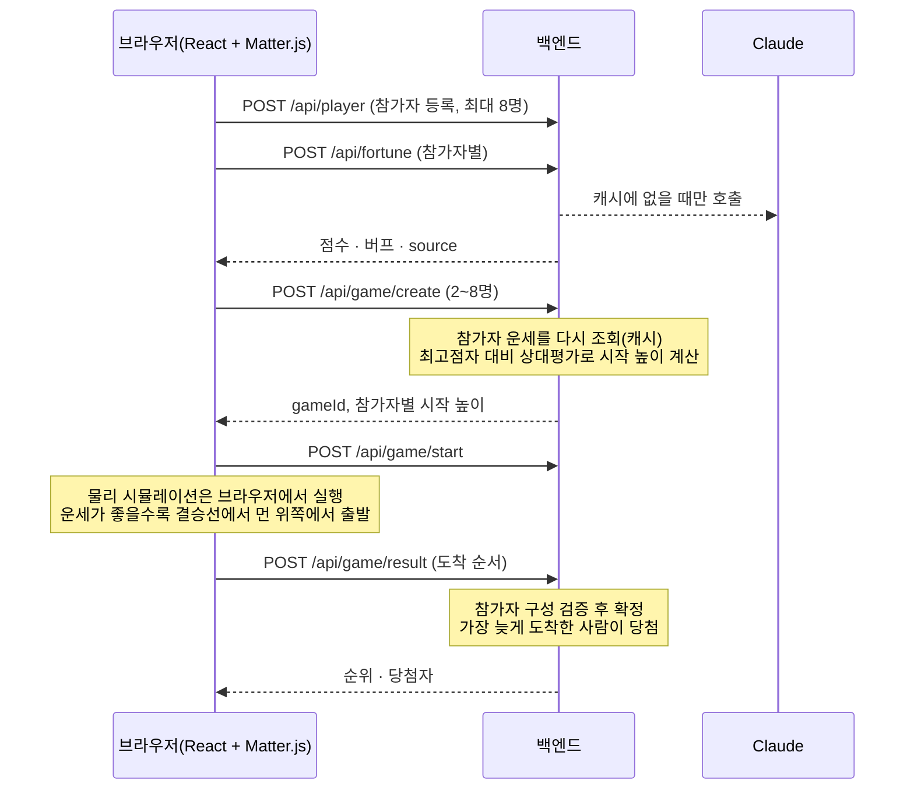

# 01. 아키텍처

AI Lucky Pinball의 전체 구성, 요청이 흐르는 길, 핵심 설계 판단을 정리한 문서입니다. (구현 과정과 시행착오는 `devhelp/`에 있습니다.)

## 1. 전체 구성



| 구성 요소 | 기술 | 역할 |
|---|---|---|
| 프론트엔드 | React 19 + TypeScript + Vite, Matter.js | 참가자 등록, 운세 카드, **핀볼 물리 시뮬레이션(브라우저에서 실행)**, 관리자 화면, 학습 페이지 |
| 백엔드 | Java 17, Spring Boot 4, Spring Data JPA | 참가자·운세·게임 상태 관리, Claude 호출과 캐시, 관리자 API |
| DB | Neon PostgreSQL(운영) / H2(로컬·테스트) | 참가자, 운세 이력(캐시 겸용), 게임·참가자·순위, 오류 로그 |
| AI | Anthropic Claude Haiku 4.5 (Java SDK, 구조화 출력) | 이름·생년월일로 오늘의 점수·행운의 숫자·메시지 생성 |
| 배포 | Vercel(프론트), Render Docker(백엔드), Neon(DB) | `master` push 시 자동 배포 |
| 보조 | GitHub Actions(CI), cron-job.org(슬립 방지) | 테스트·빌드 자동화, 무료 티어 슬립 완화 |

레거시 Vanilla JS 프론트엔드(`frontend/`)도 함께 유지하고 있습니다(같은 물리 로직의 사본).

## 2. 백엔드 구조

패키지는 도메인별로 나눴습니다.

| 패키지 | 주요 클래스 | 하는 일 |
|---|---|---|
| `player` | `PlayerController`, `PlayerService`, `PlayerEntity` | 참가자 등록, DB TEST용 재사용 신원 조회 |
| `fortune` | `FortuneQueryService`, `FortuneService`(인터페이스), `ClaudeFortuneGenerator`, `MockFortuneGenerator`, `BuffCalculator`, `AiHealthService` | 운세 조회(캐시·잠금·임시 점수), Claude 호출, 버프 계산, AI 연결 점검 |
| `game` | `GameController`, `GameService`, `GameSession`(도메인), `GameRepository`(인터페이스), `JpaGameRepository` | 게임 생성(상대평가 시작 높이)·시작·결과 확정 |
| `admin` | `AdminController`, `AdminAuthController`, `AdminAuthFilter`, `AdminSessionStore` | 관리자 로그인·토큰, 조회 API |
| `common` | `TraceIdFilter`, `RateLimitFilter`, `GlobalExceptionHandler`, `ApiException`, `ErrorLogStore`, `KeyedLock` | 추적 ID, 요청 제한, 예외 처리, 오류 로그 저장, 키별 잠금 |
| `config` | `WebConfig` | CORS |

### 요청이 지나는 길

```
요청 → TraceIdFilter(추적 ID 발급, X-Trace-Id 응답 헤더, MDC)
     → RateLimitFilter(/api/fortune만 방문자 IP당 분당 20회 — IP는 Cloudflare의 True-Client-IP)
     → AdminAuthFilter(/api/admin/** 토큰 확인, 로그인·로그아웃 제외)
     → Controller → Service → Repository(JPA) → DB
예외 → GlobalExceptionHandler → {"error", "traceId"} 응답 + 관리자 오류 로그 저장(DB, 최근 1000건)
```

필터가 직접 쓰는 401/429 응답도 같은 형식(`error`, `traceId`)과 CORS 헤더를 갖습니다.

## 3. 운세 요청 흐름

비용이 드는 Claude 호출을 최소화하고, Claude가 실패해도 게임이 계속되게 하는 부분입니다.



- **신원 캐시**: 같은 이름+생년월일이면 최초 1회만 Claude를 부르고 이후에는 DB 결과를 재사용합니다.
- **신원별 잠금**(`KeyedLock`): 같은 신원의 요청이 동시에 겹치면 각자 Claude를 부르던 경쟁 상태를 막습니다(동시 6건 → 수정 전 6번, 수정 후 1번).
- **임시 점수(FALLBACK)**: Claude 5xx·타임아웃이면 규칙 기반 점수로 진행합니다. 캐시에 넣지 않아 AI가 복구되면 진짜 결과를 받습니다.
- **게임 생성 경로**(`getFortuneForGame`)는 이미 받은 임시 점수를 재사용해, Claude가 죽어 있을 때 참가자마다 다시 기다리지 않습니다.

## 4. 게임 한 판의 흐름



게임 상태는 `CREATED → STARTED → FINISHED` 순서로만 바뀝니다. 끝난 게임의 재시작과 시작 전 결과 보고는 409로 거절합니다.

## 5. 프론트엔드 구조

| 위치 | 하는 일 |
|---|---|
| `pages/GamePage.tsx` | 참가자 목록 state를 한곳에 두고 등록·운세·게임 영역에 내려줌 |
| `components/RegistrationForm`, `FortuneSection`, `PinballBoard`, `ResultBanner` | 등록, 운세 카드, 보드(엔진 마운트·정리만), 결과 배너 |
| `game/engine.ts` | 물리 엔진. React 밖에서 명령형으로 DOM을 직접 갱신. Matter.js 호출은 `MatterAdapter` 클래스 안에 모음 |
| `pages/AdminPage.tsx` + 관리자 컴포넌트 | 로그인, 참가자·게임·오류 로그 조회, AI 연결 확인 |
| `pages/StudyReact*`, `study/react/` | 공부하기 > React 학습 페이지(서버 호출 없음, lazy 로딩) |
| `api/client.ts` | API 호출 공통 처리(관리자 토큰, 5xx 메시지에 오류 ID 표시) |

## 6. 핵심 설계 판단

| 판단 | 이유 |
|---|---|
| **물리 시뮬레이션은 브라우저에서** | 서버 부하 없이 60fps 애니메이션. 대신 결과 조작을 서버가 검증할 수 없는 한계가 있음(`04_알려진_한계`) |
| **교체 지점을 인터페이스로** (`FortuneService`, `GameRepository`, `PlayerJpaRepository`) | Mock → Claude, 메모리 → JPA 교체를 호출부 변경 없이 실제로 해냄 |
| **DB를 AI 결과 캐시로 사용** | Redis 없이 이름+생년월일로 재사용, 비용 절감. 이력 테이블과 캐시를 겸함 |
| **버프는 이번 판 참가자끼리 상대평가** | AI 점수가 60~70점대로 몰려 절대 점수로는 차이가 안 보였음 |
| **외부 장애는 임시 점수로 흡수** | Claude 장애·크레딧 소진에도 게임이 멈추지 않게. 캐시는 오염시키지 않음 |
| **모든 요청에 추적 ID** | 사용자가 본 오류 ID로 서버 로그의 해당 요청을 바로 찾음 |
| **설정은 환경변수로 덮어쓰기** | 소스에는 H2 기본값만, 운영 DB·API 키·관리자 계정은 배포 환경변수로(비밀 값이 git에 없음) |
