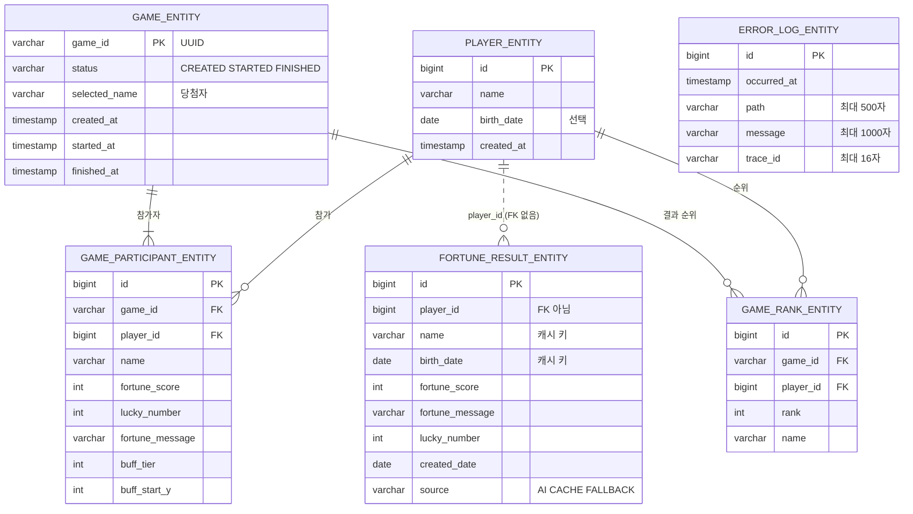

# 03. DB 스키마 (현재 엔티티 기준)

운영은 Neon PostgreSQL, 로컬 개발은 H2 파일 DB, 테스트는 메모리 H2입니다. 테이블은 JPA 엔티티로 정의하고 `ddl-auto: update`가 맞춥니다(마이그레이션 도구 미적용). 테이블 이름은 Spring Boot 기본 규칙에 따라 엔티티 이름의 snake_case입니다.

> `plan/03_db-schema.md`는 MVP 당시 설계(게임은 메모리 저장)라 지금과 다릅니다.

## 1. ERD

## 2. 테이블별 설명

| 테이블 | 하는 일 | 특징 |
|---|---|---|
| `player_entity` | 참가자 1건(등록할 때마다 새 행) | 같은 사람이 다시 와도 새 `id`. 신원 구분은 이름+생년월일로 함 |
| `fortune_result_entity` | 운세 조회 이력 **겸 AI 결과 캐시** | `name`·`birth_date`를 비정규화해서 저장 — 다른 `player_id`라도 이름+생년월일이 같으면 같은 결과를 재사용하기 위해 |
| `game_entity` | 게임 한 판의 상태 | PK는 UUID 문자열. 참가자·순위를 `cascade = ALL`로 함께 저장 |
| `game_participant_entity` | 그 판에 확정된 참가자별 운세·시작 높이 | 생성 시점의 값을 그대로 보관(나중에 운세가 바뀌어도 그 판의 기록은 유지) |
| `game_rank_entity` | 결과 순위 | `(game_id, player_id)` 유니크 제약 — 한 판에 같은 사람이 두 번 순위에 오르지 않게 |
| `error_log_entity` | 관리자 화면용 오류 로그 | 최근 1000건만 유지(저장할 때마다 오래된 행 삭제), 화면에는 200건 |

## 3. 설계 판단과 알아 둘 점

- **`fortune_result_entity.source`**: `AI`(이번에 Claude 호출) / `CACHE`(재사용) / `FALLBACK`(Claude 실패로 임시 점수). 캐시 조회는 `AI`·`CACHE`만 대상이고 `FALLBACK`은 제외합니다 — 임시 점수가 그 신원의 "정답"으로 굳지 않게 하려는 것입니다.
- **`fortune_result_entity.player_id`에는 외래키를 두지 않았습니다.** 이력 겸 캐시 테이블이라 참가자 행과 생명주기를 묶지 않으려는 판단입니다. 게임 쪽(`game_participant_entity`, `game_rank_entity`)은 외래키로 참가자와 연결했습니다.
- **인덱스를 따로 두지 않았습니다.** 캐시 조회(`name`, `birth_date`, `source`)와 참가자별 이력 조회(`player_id`)가 지금 규모에서는 문제없지만, 데이터가 늘면 `(name, birth_date)`와 `player_id` 인덱스가 먼저 필요합니다.
- **같은 신원 동시 요청의 중복 저장은 애플리케이션 잠금으로 막습니다**(DB 제약이 아님). 서버를 여러 대로 늘리면 DB 유니크 제약 같은 방법이 필요합니다(`04_알려진_한계`).
- **스키마 변경은 `ddl-auto: update`** 가 컬럼 추가 정도만 자동으로 해 줍니다. 컬럼 이름 변경·삭제나 이력 관리는 하지 않으므로, 운영 데이터가 중요해지면 Flyway 같은 마이그레이션 도구가 필요합니다(방법은 `devhelp/07` 참고).
