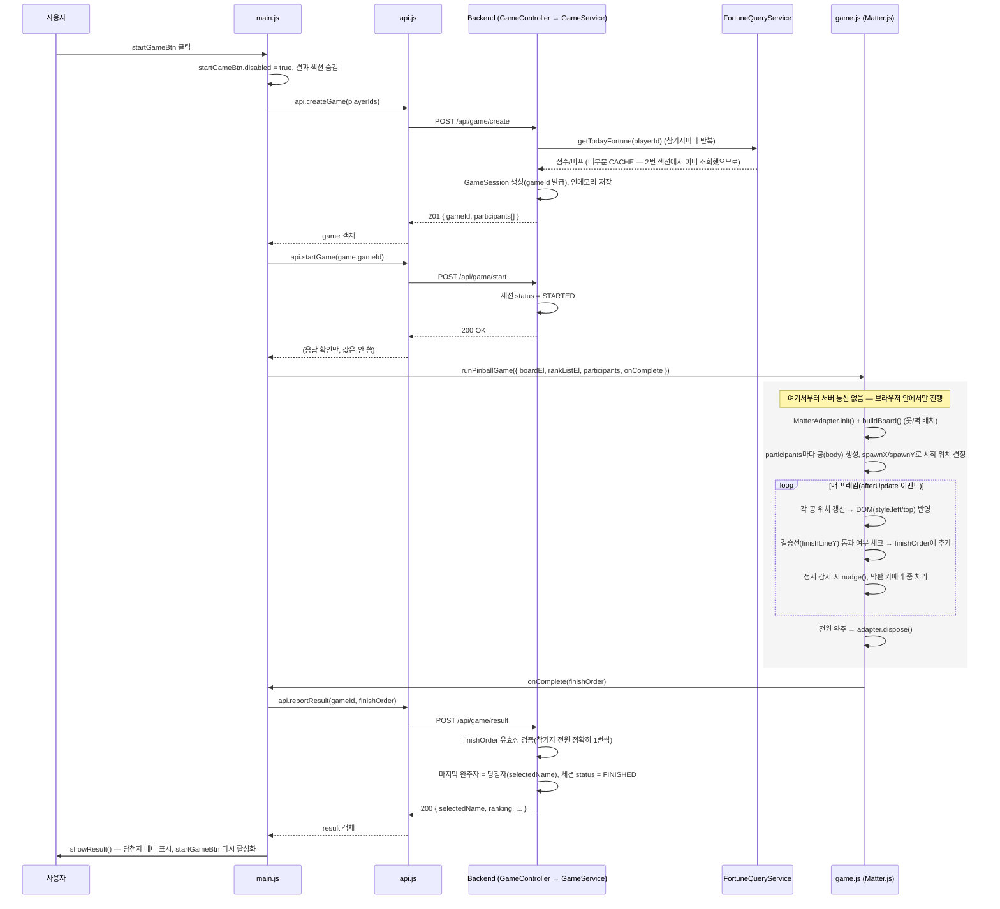

# 05. React 마이그레이션

"게임 시작" 버튼 하나의 흐름을 프론트부터 백엔드까지 따라가 본 뒤, React 버전을 실제로 구현한 기록이다.

> 원래 따로 있던 기록 2개를 2026-10-04에 하나로 묶었다. 내용은 그대로 두고 시간 순서대로 이어 붙였으며, 각 절 제목의 "[구 NN]"이 원래 문서 번호다.

**포함된 기록**

- [구 22] "게임 시작" 버튼 클릭 — 프론트엔드부터 백엔드까지 전체 흐름
- [구 23] React 마이그레이션 1차 구현 — 뼈대부터 전체 기능 동등성까지


> **AI 코멘트: 흐름도에서 바뀐 곳과 남은 결정**
>
> [구 22] 흐름도에서 지금과 다른 곳:
>
> | 흐름도 | 지금 |
> |---|---|
> | 게임 생성 때 `getTodayFortune()`으로 운세를 다시 조회 | `getFortuneForGame()`. Claude 장애로 받은 임시 점수가 있으면 그대로 써서 다시 기다리지 않음(`devhelp/09`(구 41)) |
> | 게임은 메모리에 저장 | DB에 저장(`devhelp/07`) |
> | `api.startGame()` 응답은 안 쓰임 | 응답은 여전히 안 쓰지만, 시작하지 않은 게임의 결과 보고를 409로 거절해서 시작 호출이 의미를 가짐(`devhelp/09`(구 45)) |
>
> 서버가 도착 순서 조작을 알아내지 못한다는 점은 지금도 같고, `devhelp/13`에 한계로 적었습니다.
>
> [구 22]처럼 위치를 "170행" 같은 줄 번호로 적으면 코드가 조금만 바뀌어도 틀립니다(지금 대부분 안 맞습니다). 함수 이름으로 적는 편이 오래갑니다.
>
> 남은 결정: plan/06의 7단계(레거시 `frontend/` 교체)는 하지 않았습니다. 그래서 물리 값을 바꿀 때마다 두 파일을 고쳤고(`devhelp/02`), 상대평가 공식도 세 곳에 있습니다(`devhelp/03`). 레거시를 남길 거라면 "더 이상 맞추지 않는 보관용"으로 정하고, 아니면 지우는 것이 관리하기 편합니다.

---

## [구 22] "게임 시작" 버튼 클릭 — 프론트엔드부터 백엔드까지 전체 흐름

`index.html`의 `startGameBtn`(3번째 섹션, "게임 시작" 버튼)을 눌렀을 때 실제로 어떤 순서로 코드가 실행되는지 정리한다. 핵심만 먼저 말하면: **물리 시뮬레이션(공이 굴러가는 것) 자체는 100% 브라우저에서만 돈다.** 백엔드는 "누가 참여하는지/누가 이겼는지"만 기록하고, 결승선까지 굴러가는 과정 자체는 서버와 아무 통신이 없다.

### 1. 전체 시퀀스 다이어그램



### 2. 단계별 코드 위치

| 단계 | 파일 | 함수/위치 |
|---|---|---|
| 버튼 클릭 리스너 | `frontend/js/main.js` | `els.startGameBtn.addEventListener('click', ...)` (170행) |
| 게임 세션 생성 요청 | `frontend/js/api.js` → `frontend/js/main.js` | `api.createGame()` → `POST /api/game/create` |
| 게임 생성 처리 | `backend/.../game/GameController.java` | `create()` (26행) |
| 참가자별 운세 재조회 | `backend/.../game/GameService.java` | `createGame()` → `toParticipant()` (92행), 내부적으로 `FortuneQueryService.getTodayFortune()` 호출 |
| 게임 시작 처리 | `backend/.../game/GameController.java` / `GameService.java` | `start()` |
| 물리 시뮬레이션 실행 | `frontend/js/game.js` | `runPinballGame()` (279행) |
| 완주 판정 & 콜백 | `frontend/js/game.js` | `adapter.run(() => { ... onComplete(finishOrder) })` (312행) |
| 결과 보고 | `frontend/js/api.js` → `frontend/js/main.js` | `api.reportResult()` → `POST /api/game/result` |
| 결과 검증/당첨자 확정 | `backend/.../game/GameService.java` | `reportResult()` (49행) |
| 화면에 결과 표시 | `frontend/js/main.js` | `showResult()` (201행) |

### 3. 눈여겨볼 점

- **`/api/game/create`가 운세를 한 번 더 조회한다.** 2번 섹션("운세 확인")에서 이미 `POST /api/fortune`으로 각자의 운세를 확인했는데, `GameService.toParticipant()`가 `FortuneQueryService.getTodayFortune()`을 또 호출한다. 다만 이름+생년월일 조합이 이미 DB에 있으므로 대부분 `source=CACHE`로 즉시 반환되고 AI를 다시 호출하지 않는다(devhelp/03(구 13)의 영구 캐시 설계 덕분). 즉 "게임 시작"을 누르는 순간, 화면에 이미 표시된 버프값이 서버 쪽에서 한 번 더 확정되어 `GameParticipant`에 박히는 구조다.
- **물리 시뮬레이션은 순수 클라이언트 로직이다.** `runPinballGame()` 내부 루프(공 위치 갱신, 결승선 판정, 정지 감지, 카메라 연출)는 전부 브라우저 메모리 안에서만 일어나고, 게임이 끝날 때까지 백엔드에는 어떤 요청도 가지 않는다. 백엔드는 게임이 "생성됐다"는 것과 "끝났다"는 것 두 시점만 알 뿐, 중간 과정(누가 몇 등으로 굴러가고 있는지 등)은 전혀 모른다.
- **서버는 결과를 신뢰하지 않고 검증한다.** `GameService.reportResult()`는 클라이언트가 보낸 `finishOrder`가 "세션 생성 시 등록된 참가자 전원을 정확히 1번씩 포함하는지"를 검사한다(56~63행). 순서 자체(누가 몇 등인지)는 클라이언트 물리 시뮬레이션 결과를 그대로 신뢰하지만, 참가자 목록 위변조는 막는다 — 물리 계산을 서버에서 다시 하지 않는 구조이므로 이 최소한의 무결성 체크만 존재한다.
- **`api.startGame()` 응답은 사실상 안 쓰인다.** `main.js`는 `await api.startGame(game.gameId)`만 하고 반환값을 사용하지 않는다 — 서버 쪽 상태를 `STARTED`로 바꿔두는 것 자체가 목적(관리자 화면에서 게임 상태를 구분하기 위함)이며, 프론트는 이 호출이 끝나는 대로 바로 `runPinballGame()`을 실행한다.
- **`startGameBtn`은 게임이 끝나야(성공/실패 무관) 다시 눌린다.** `onComplete` 콜백의 `finally` 블록(main.js 188~192행)에서 결과 보고 성공/실패와 무관하게 버튼을 다시 활성화한다 — 매번 새 `gameId`로 새 세션이 만들어지므로 재시작이 안전하다.

---

## [구 23] React 마이그레이션 1차 구현 — 뼈대부터 전체 기능 동등성까지

`plan/06_react-migration-plan.md`에서 세운 8단계 작업 순서를 따라 `frontend-react/`(Vite + React + TypeScript)를 실제로 구현했다. 기존 `frontend/`(바닐라 JS)는 **그대로 남겨두고** 나란히 만들었다 — plan 06의 7단계("기능 동등성 확인 후 전환")가 아직 완료되지 않았으므로 교체는 하지 않았다.

### 1. 착수 시 결정한 것

- **언어: TypeScript** (plan 06 권장안 채택)
- **05번 백로그 A1(좌측 사이드바 메뉴)과 A3(관리자 페이징 20줄)을 이번 전환과 같이 진행** — plan 06의 8단계("이번에 같이 해결하기 좋은 백로그 항목")에서 미리 언급했던 항목을 실제로 결합했다.
- React Query는 도입하지 않음 — plan 06에서 이미 "필수 아님"으로 판단했고, `useEffect`+`useState`만으로 충분한 규모였다.

### 2. 실제로 한 일 (plan 06의 8단계 중 1~6단계 해당)

| 단계 | 내용 |
|---|---|
| 1. 뼈대 세팅 | `npm create vite@latest frontend-react -- --template react-ts`, `react-router-dom`/`matter-js`/`@types/matter-js` 설치. 백엔드 `WebConfig`의 CORS 허용 목록에 Vite 기본 포트(5173) 추가 |
| 2. API 계층 이식 | `frontend/js/api.js` → `frontend-react/src/api/client.ts`. 함수 시그니처는 그대로 두고 요청/응답 타입(`Player`, `FortuneResponse`, `GameParticipant`, `AdminPlayer` 등)을 인터페이스로 명시 |
| 3. 관리자 화면 | `AdminPage` + `PlayersTable`/`GamesTable`/`LogList`/`OverrideForm`. **A3 반영**: `PlayersTable`에 `Pagination` 컴포넌트를 붙여 20줄 단위로 자름 |
| 4. 게임 화면(쉬운 부분) | `RegistrationForm`, `FortuneSection`, `ResultBanner` — 폼 상태는 `useState`로, 6자리 생년월일 파싱(`parseBirthDateShorthand`)은 `utils/birthDate.ts`로 분리 |
| 5. `PinballBoard`(가장 어려운 부분) | `frontend/js/game.js`를 `game/engine.ts`로 **로직 변경 없이** 포팅(TS 타입만 추가). devhelp/04(구 21)에서 미리 설계한 대로 `useRef`+`useEffect`로 감싸고, cleanup에서 `dispose()`를 호출해 StrictMode 이중 실행에 대비 |
| 6. 스타일 | 기존 `frontend/css/style.css`를 `src/styles/style.css`로 그대로 옮기고 전역 import. 여기에 **A1(사이드바)**과 **A3(페이지네이션)**을 위한 CSS만 추가 |
| (추가) A1 사이드바 | `components/Layout.tsx` — 기존 상단 중앙 탭(`nav.tabs`)을 좌측 세로 메뉴로 재배치. `react-router-dom`의 `NavLink`+`Outlet` 사용 |

### 3. 물리 엔진 이식 관련 — devhelp/04(구 21) 설계가 실제로 맞았는가

devhelp/04(구 21)에서 예상했던 접근(`runPinballGame` 시그니처를 그대로 두고 React는 mount/unmount 경계만 담당)이 실제로도 그대로 통했다. `game/engine.ts`에서 바뀐 것은:

- `Matter` import 방식: `<script>` 전역 대신 `import * as Matter from 'matter-js'` (CDN 0.19.0 → npm 0.20.0로 버전이 살짝 올라갔지만 사용한 API는 전부 호환)
- `runPinballGame`이 이제 **dispose 함수를 반환**하도록 살짝 바꿈 — devhelp/04(구 21)이 언급했던 "게임 도중 컴포넌트가 갑자기 사라지는 경우"에 대비해, `PinballBoard`의 `useEffect` cleanup에서 이 dispose 함수를 직접 호출할 수 있게 했다 (원래 코드는 게임이 정상 종료될 때만 내부에서 `adapter.dispose()`를 불렀다).

그 외 갈톤보드 구성, spawnX/spawnY 계산, 정지 감지(`nudge`), 카메라 줌 로직은 전부 한 글자도 안 바꿨다 — devhelp/02(구 09·11·12)에서 어렵게 잡은 버그를 다시 밟지 않기 위한 원칙을 그대로 지켰다.

### 4. 검증

`npm run build`(TypeScript 컴파일 + Vite 빌드)가 에러 없이 통과하는 것과 별개로, 실제 브라우저 동작을 Playwright로 확인했다:

1. `/`(게임 화면), `/admin`(관리자 화면) 진입 시 콘솔 에러 없음
2. 관리자 화면: 66명의 기존 테스트 참가자 데이터가 20줄씩 4페이지로 정상 분할되어 표시됨(A3 검증)
3. 실사용 흐름 전체 재현: 참가자 2명 등록(생년월일 미입력) → "운세 확인"(NONE 소스로 정상 표시) → "게임 시작" → 핀볼 보드에 못/공이 렌더링되고 실시간 순위 패널이 갱신됨 → 결승선 통과 후 결과 배너에 실제 백엔드 `gameId`와 당첨자 이름이 표시됨

캡처한 스크린샷 기준으로 vanilla JS 버전(`frontend/`)과 시각적으로 동일한 레이아웃·색상·애니메이션을 확인했다(사이드바 부분만 A1 반영으로 의도적으로 다름).

### 5. 남은 것

- **plan 06의 7단계(기능 동등성 확인 후 기존 `frontend/` 교체)는 아직 하지 않았다** — `frontend/`와 `frontend-react/`가 당분간 나란히 존재한다. 실제 교체(기존 폴더 삭제/대체) 여부는 별도 확인 후 진행한다.
- `plan/01_mvp-plan.md` §5(배포 방식 문서)는 이번 범위에 포함하지 않음 — plan 06에서 이미 "착수 시점에 반영"이라고 남겨둔 항목.
- `.gitignore`에 `dist/`, `*.tsbuildinfo`를 추가해 `frontend-react/`의 빌드 산출물이 커밋되지 않도록 함(`node_modules/`는 기존 규칙에 이미 포함되어 있었음).

### 6. 로컬 실행 방법

```bash
cd frontend-react
npm install       # 최초 1회
npm run dev        # http://localhost:5173
```

백엔드는 기존과 동일하게 `cd backend && ./gradlew bootRun`으로 별도 실행한다. CORS 허용 목록에 5173 포트가 추가되어 있어 별도 설정 없이 바로 통신된다.
