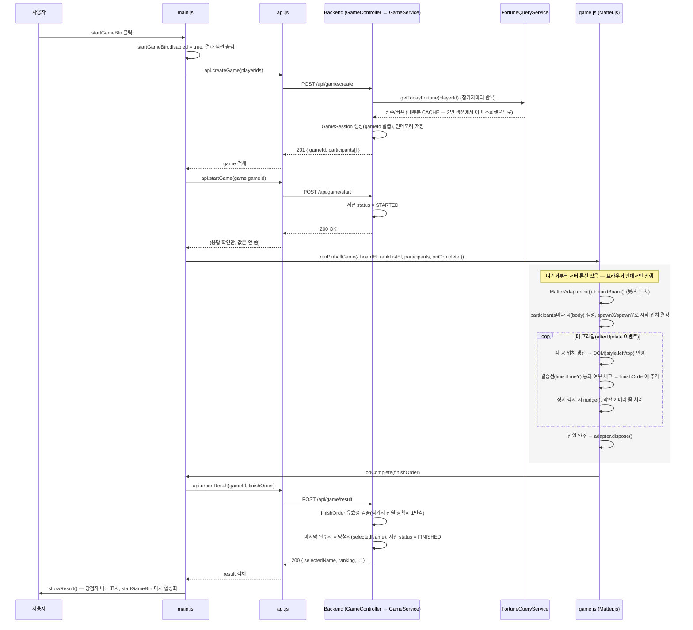

# 22. "게임 시작" 버튼 클릭 — 프론트엔드부터 백엔드까지 전체 흐름

`index.html`의 `startGameBtn`(3번째 섹션, "게임 시작" 버튼)을 눌렀을 때 실제로 어떤 순서로 코드가 실행되는지 정리한다. 핵심만 먼저 말하면: **물리 시뮬레이션(공이 굴러가는 것) 자체는 100% 브라우저에서만 돈다.** 백엔드는 "누가 참여하는지/누가 이겼는지"만 기록하고, 결승선까지 굴러가는 과정 자체는 서버와 아무 통신이 없다.

## 1. 전체 시퀀스 다이어그램

## 2. 단계별 코드 위치

| 단계 | 파일 | 함수/위치 |
|---|---|---|
| 버튼 클릭 리스너 | `frontend/js/main.js` | `els.startGameBtn.addEventListener('click', ...)` (170행) |
| 게임 세션 생성 요청 | `frontend/js/api.js` → `frontend/js/main.js` | `api.createGame()` → `POST /api/game/create` |
| 게임 생성 처리 | `backend/.../game/GameController.java` | `create()` (26행) |
| 참가자별 운세 재조회 | `backend/.../game/GameService.java` | `createGame()` → `toParticipant()` (92행), 내부적으로 `FortuneQueryService.getTodayFortune()` 호출 |
| 게임 시작 처리 | `backend/.../game/GameController.java` / `GameService.java` | `start()` |
| 물리 시뮬레이션 실행 | `frontend/js/game.js` | `runPinballGame()` (279행) |
| 완주 판정 & 콜백 | `frontend/js/game.js` | `adapter.run(() => { ... onComplete(finishOrder) })` (312행) |
| 결과 보고 | `frontend/js/api.js` → `frontend/js/main.js` | `api.reportResult()` → `POST /api/game/result` |
| 결과 검증/당첨자 확정 | `backend/.../game/GameService.java` | `reportResult()` (49행) |
| 화면에 결과 표시 | `frontend/js/main.js` | `showResult()` (201행) |

## 3. 눈여겨볼 점

- **`/api/game/create`가 운세를 한 번 더 조회한다.** 2번 섹션("운세 확인")에서 이미 `POST /api/fortune`으로 각자의 운세를 확인했는데, `GameService.toParticipant()`가 `FortuneQueryService.getTodayFortune()`을 또 호출한다. 다만 이름+생년월일 조합이 이미 DB에 있으므로 대부분 `source=CACHE`로 즉시 반환되고 AI를 다시 호출하지 않는다(devhelp/13의 영구 캐시 설계 덕분). 즉 "게임 시작"을 누르는 순간, 화면에 이미 표시된 버프값이 서버 쪽에서 한 번 더 확정되어 `GameParticipant`에 박히는 구조다.
- **물리 시뮬레이션은 순수 클라이언트 로직이다.** `runPinballGame()` 내부 루프(공 위치 갱신, 결승선 판정, 정지 감지, 카메라 연출)는 전부 브라우저 메모리 안에서만 일어나고, 게임이 끝날 때까지 백엔드에는 어떤 요청도 가지 않는다. 백엔드는 게임이 "생성됐다"는 것과 "끝났다"는 것 두 시점만 알 뿐, 중간 과정(누가 몇 등으로 굴러가고 있는지 등)은 전혀 모른다.
- **서버는 결과를 신뢰하지 않고 검증한다.** `GameService.reportResult()`는 클라이언트가 보낸 `finishOrder`가 "세션 생성 시 등록된 참가자 전원을 정확히 1번씩 포함하는지"를 검사한다(56~63행). 순서 자체(누가 몇 등인지)는 클라이언트 물리 시뮬레이션 결과를 그대로 신뢰하지만, 참가자 목록 위변조는 막는다 — 물리 계산을 서버에서 다시 하지 않는 구조이므로 이 최소한의 무결성 체크만 존재한다.
- **`api.startGame()` 응답은 사실상 안 쓰인다.** `main.js`는 `await api.startGame(game.gameId)`만 하고 반환값을 사용하지 않는다 — 서버 쪽 상태를 `STARTED`로 바꿔두는 것 자체가 목적(관리자 화면에서 게임 상태를 구분하기 위함)이며, 프론트는 이 호출이 끝나는 대로 바로 `runPinballGame()`을 실행한다.
- **`startGameBtn`은 게임이 끝나야(성공/실패 무관) 다시 눌린다.** `onComplete` 콜백의 `finally` 블록(main.js 188~192행)에서 결과 보고 성공/실패와 무관하게 버튼을 다시 활성화한다 — 매번 새 `gameId`로 새 세션이 만들어지므로 재시작이 안전하다.
